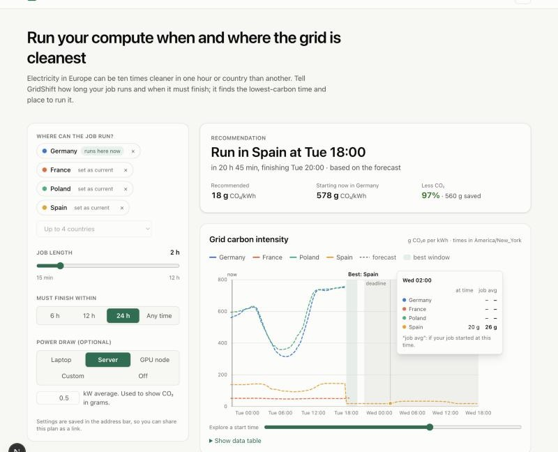
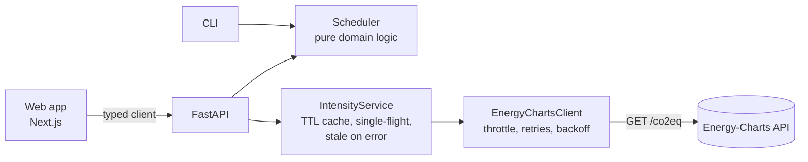

# GridShift

[](https://github.com/smymuna/gridshift/actions/workflows/ci.yml)


**Carbon-aware scheduling for compute jobs on European power grids.**

GridShift tells you *when* and *where* to run a flexible job (ML training, batch ETL, CI
builds, backups) so it uses the least carbon-intensive electricity. It uses live measured
and forecast grid carbon intensity for 26 European countries from
[Energy-Charts](https://www.energy-charts.info) (Fraunhofer ISE), and comes as a web app,
a REST API and a CLI.



*The web app on live data (6 October 2026). Hovering the chart shows what a job starting
at that time would average in each country.*

## Why

The carbon intensity of electricity in Europe changes a lot **over time** (solar at
midday, wind at night) and **between countries** (France and Norway are low-carbon,
Poland and Germany at night are coal-heavy). Many workloads don't need to run *right now*
or *right here*. Moving them to cleaner hours or regions is one of the cheapest ways to
cut software emissions. The Green Software Foundation calls this
[carbon awareness](https://learn.greensoftware.foundation/carbon-awareness).

## Getting started

You need **Node.js 22+** and **Python 3.12+**. Everything else is installed for you.

```bash
git clone https://github.com/smymuna/gridshift.git
cd gridshift
npm install
npm run dev
```

`npm run dev` starts both apps through Turborepo:

- web app: http://localhost:3000
- API: http://localhost:8000/docs

The first run creates the Python virtualenv in `apps/api/.venv` and installs the API's
dependencies, which takes about a minute.

| Command (repo root) | What it does |
|---|---|
| `npm run dev` | API + web app with hot reload |
| `npm run check` | Lint, type-check, test and build every workspace (what CI runs) |
| `npm test` | All tests: 69 Python, 20 web, 3 API client |
| `npm run openapi` | Re-export the API's OpenAPI schema and regenerate the TypeScript client |

The CLI still works on its own:

```console
$ cd apps/api && .venv/bin/gridshift schedule --zone de --zone fr --zone nl --duration 2h
Recommended : FR  Sun 10:45 -> 12:45 UTC    46.9 gCO2/kWh (forecast)
Run now     : DE  Sun 05:04 -> 07:04 UTC   691.3 gCO2/kWh (forecast)
Savings     : 93.2% lower carbon intensity
```

## Repository layout

```
apps/
├── api/            Python FastAPI service + CLI (scheduler, Energy-Charts client, cache)
└── web/            Next.js 16 app (React 19, Tailwind CSS 4, TanStack Query)
packages/
└── api-client/     TypeScript client generated from the API's OpenAPI schema
docs/adr/           Architecture decision records
turbo.json          Task graph: lint, typecheck, test, build, dev
```

The API's Pydantic models are the single source of truth for the contract:
`npm run openapi` exports them to `packages/api-client/openapi.json` and generates
TypeScript types with `openapi-typescript`, so the web app is type-checked against
the real API. CI fails if the committed client is out of date.
[ADR 0004](docs/adr/0004-monorepo-and-typed-contract.md).

## Web app

- **Planner:** pick up to four countries (the first is where the job runs by default), the
  job length, a deadline and, optionally, the job's power draw. The recommendation
  updates as you change anything.
- **Chart:** measured (solid) and forecast (dashed) intensity per country, the
  recommended window, now and the deadline. Hover or use the time slider to see each
  country's intensity and a job's average if it started then.
- **Shareable:** the plan lives in the URL (`?zones=de,fr&duration=120&by=24&kw=0.5`).
- **Accessible and themable:** the slider gives keyboard and screen-reader access
  to the chart, there is a data-table view, and dark mode. The series colours were
  checked for colour-vision deficiency in both themes.

## API

Interactive OpenAPI docs are at `/docs` when the server is running.

| Method | Path | Purpose |
|---|---|---|
| `POST` | `/v1/schedule` | Best window across one or more zones before a deadline |
| `GET` | `/v1/zones` | The 26 supported countries |
| `GET` | `/v1/intensity/{zone}` | Measured and forecast intensity series (`?include_past=true` for history) |
| `GET` | `/healthz` | Liveness probe |

```bash
curl -X POST localhost:8000/v1/schedule -H 'content-type: application/json' \
  -d '{"zones": ["de", "fr", "nl"], "duration_minutes": 120, "power_kw": 0.4}'
```

```json
{
  "recommended": {"zone": "fr", "start": "2026-10-04T10:45:00Z", "end": "2026-10-04T12:45:00Z",
                  "avg_gco2_per_kwh": 46.9, "uses_forecast": true, "emissions_g": 37.5},
  "run_now":     {"zone": "de", "start": "2026-10-04T05:01:35Z", "end": "2026-10-04T07:01:35Z",
                  "avg_gco2_per_kwh": 695.7, "uses_forecast": true, "emissions_g": 556.5},
  "savings_pct": 93.3,
  "emissions_saved_g": 519.0,
  "delay_minutes": 343,
  "attribution": "Carbon intensity data: Energy-Charts.info, Fraunhofer ISE"
}
```

Errors use [RFC 9457](https://www.rfc-editor.org/rfc/rfc9457) problem details
(`application/problem+json`): `404` unknown zone, `422` no window fits before the
deadline, `502`/`503` when the data provider fails.

## How it works



**Window search.** Measured values and the forecast are merged into one 15-minute series.
The scheduler builds a prefix integral over each gap-free stretch, so the
**time-weighted** average for any start time is computed in O(1). Starts that don't fall
on a 15-minute boundary (now is 10:07) and durations that aren't multiples of 15 minutes
are both handled exactly. It can be proven that only O(n) candidate start times can be
optimal, and only those are checked. The result is verified against brute-force search
on hundreds of random series. Details:
[ADR 0002](docs/adr/0002-window-search.md).

**Talking to a rate-limited API.** Energy-Charts returns HTTP 429 quickly. The client
retries 429/5xx with exponential backoff and honours `Retry-After`. The service caches
each zone for 15 minutes (the data's update interval) and merges concurrent requests for
the same zone into one upstream call. Upstream calls are spaced at least one second apart
across all users, and if a refresh still fails the last good data (up to 6 hours old) is
served instead of an error.
[ADR 0003](docs/adr/0003-caching-and-retries.md).

## Engineering

- **Tests:** 69 Python tests (90%+ branch coverage enforced): scheduler edge cases and
  randomized brute-force comparison, HTTP client behaviour (retries, `Retry-After`,
  throttling, malformed payloads), the cache (TTL, single-flight, stale on error), and
  the API contract. 23 TypeScript tests (Vitest + Testing Library): URL plan parsing,
  the time-weighted job average, chart and recommendation components, and the client.
- **Static checks:** `ruff` and `mypy --strict` for Python; Biome and `tsc` for TypeScript.
- **CI:** one Turborepo run of lint, type-check, test and build for every workspace,
  an API-contract drift check, Python 3.13 tests, and a Docker build and smoke test.
- **Container:** multi-stage build, non-root user, health check, honours `$PORT`.

## Deployment

| Piece | Where | Config |
|---|---|---|
| API | [Render](https://render.com), free web service, Frankfurt | [`render.yaml`](render.yaml); set `GRIDSHIFT_CORS_ORIGINS` to the web app's URL |
| Web app | [Vercel](https://vercel.com), free plan | Root directory `apps/web`; set `NEXT_PUBLIC_API_URL` to the API's URL |

No database is needed. On Render's free plan the API sleeps after 15 minutes without
traffic, so the first request can take up to a minute.

## Limitations

Being honest about these matters for anything that reports emissions:

- **Average, not marginal, intensity.** The data is average (location-based) grid
  intensity per country. Moving load shifts *marginal* generation, which can differ.
  Results are good for comparing options, not for carbon accounting.
- **Forecasts are forecasts.** Most recommendations are based on forecast values
  (`uses_forecast: true`). Accuracy depends on Energy-Charts' model, and the horizon
  differs by country (6 hours for some, up to 2 days for others). Some day-two forecasts
  look implausibly flat (Spain at about 20 g/kWh for a whole day, seen 6 Oct 2026), so the
  web app advises a deadline within 24 hours for important jobs.
- **Country level.** Zones are countries, not bidding zones or specific data centres.
  Data centre PUE, and the network cost of moving data across borders, are not included.
- **Operational emissions only.** Embodied emissions of hardware are out of scope.
- **Single provider, in-memory cache.** Fine for one instance. Several replicas would each
  fetch separately; a shared cache (Redis) would be next.

## Roadmap

- Second data provider (Electricity Maps) behind the existing `IntensityProvider` interface
- Kubernetes integration: a CronJob/controller that delays jobs using GridShift
- Record forecasts vs. actuals to measure forecast error per country
- Marginal emissions signal where available

## Data and licence

Carbon intensity data from [Energy-Charts.info](https://www.energy-charts.info),
Fraunhofer Institute for Solar Energy Systems ISE. Please check their terms before using
it beyond personal or research use.

Code is MIT licensed, see [LICENSE](LICENSE).
