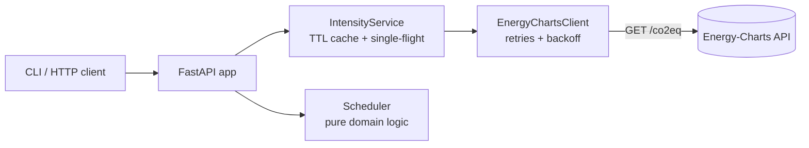

# GridShift

[](https://github.com/smymuna/gridshift/actions/workflows/ci.yml)


**Carbon-aware scheduling for compute jobs on European power grids.**

GridShift tells you *when* and *where* to run a flexible job (ML training, batch ETL, CI
builds, backups) so it uses the least carbon-intensive electricity. It uses live measured
and forecast grid carbon intensity from [Energy-Charts](https://www.energy-charts.info)
(Fraunhofer ISE) and is available as a REST API and a CLI.

```console
$ gridshift schedule --zone de --duration 2h --deadline 2026-10-05T06:00Z
Recommended : DE  Sun 10:15 -> 12:15 UTC   232.5 gCO2/kWh (forecast)
Run now     : DE  Sun 05:04 -> 07:04 UTC   691.3 gCO2/kWh (forecast)
Savings     : 66.4% lower carbon intensity

$ gridshift schedule --zone de --zone fr --zone nl --duration 2h --deadline 2026-10-05T06:00Z
Recommended : FR  Sun 10:45 -> 12:45 UTC    46.9 gCO2/kWh (forecast)
Run now     : DE  Sun 05:04 -> 07:04 UTC   691.3 gCO2/kWh (forecast)
Savings     : 93.2% lower carbon intensity
```

*Real output from 4 October 2026. Waiting for German midday solar cuts intensity by two
thirds. Being allowed to move to France's mostly nuclear grid cuts it by 93%.*

## Why

The carbon intensity of electricity in Europe changes a lot **over time** (solar at
midday, wind at night) and **between countries** (France and Norway are low-carbon,
Poland and Germany at night are coal-heavy). Many workloads don't need to run *right now*
or *right here*. Moving them to cleaner hours or regions is one of the cheapest ways to
cut software emissions. The Green Software Foundation calls this
[carbon awareness](https://learn.greensoftware.foundation/carbon-awareness).

## Quick start

```bash
python -m venv .venv && source .venv/bin/activate
pip install -e ".[dev]"

gridshift schedule --zone de --duration 90m          # time shifting only
gridshift schedule --zone de --zone fr --duration 2h # time + location shifting
gridshift serve                                      # REST API on http://127.0.0.1:8000/docs
```

With Docker:

```bash
docker build -t gridshift .
docker run -p 8000:8000 gridshift
```

## API

Interactive OpenAPI docs are at `/docs` when the server is running.

| Method | Path | Purpose |
|---|---|---|
| `POST` | `/v1/schedule` | Best window across one or more zones before a deadline |
| `GET` | `/v1/intensity/{zone}` | Measured and forecast intensity series (`?include_past=true` for history) |
| `GET` | `/healthz` | Liveness probe |

```bash
curl -X POST localhost:8000/v1/schedule -H 'content-type: application/json' \
  -d '{"zones": ["de", "fr", "nl"], "duration_minutes": 120, "power_kw": 0.4}'
```

```json
{
  "recommended": {"zone": "fr", "start": "2026-10-04T10:45:00Z", "end": "2026-10-04T12:45:00Z",
                  "avg_gco2_per_kwh": 46.9, "uses_forecast": true, "emissions_g": 37.5},
  "run_now":     {"zone": "de", "start": "2026-10-04T05:01:35Z", "end": "2026-10-04T07:01:35Z",
                  "avg_gco2_per_kwh": 695.7, "uses_forecast": true, "emissions_g": 556.5},
  "savings_pct": 93.3,
  "emissions_saved_g": 519.0,
  "delay_minutes": 343,
  "attribution": "Carbon intensity data: Energy-Charts.info, Fraunhofer ISE"
}
```

Errors use [RFC 9457](https://www.rfc-editor.org/rfc/rfc9457) problem details
(`application/problem+json`): `404` unknown zone, `422` no window fits before the
deadline, `502`/`503` when the data provider fails.

## How it works



The code is split so that the scheduling logic has no I/O and can be tested on its own:

```
src/gridshift/
├── domain/      models + window search (pure functions, no I/O)
├── adapters/    Energy-Charts HTTP client and payload parsing
├── services/    caching / request coalescing
├── api/         FastAPI routes, request/response schemas, error mapping
└── cli.py
```

**Window search.** Measured values and the forecast are merged into one 15-minute series.
The scheduler builds a prefix integral over each gap-free stretch, so the
**time-weighted** average for any start time is computed in O(1). Starts that don't fall
on a 15-minute boundary (now is 10:07) and durations that aren't multiples of 15 minutes
are both handled exactly. It can be proven that only O(n) candidate start times can be
optimal, and only those are checked. The result is verified against brute-force search
on hundreds of random series. Details:
[ADR 0002](docs/adr/0002-window-search.md).

**Talking to a rate-limited API.** Energy-Charts returns HTTP 429 quickly. The client
retries 429/5xx with exponential backoff and honours `Retry-After`. The service caches
each zone for 15 minutes (the data's update interval) and merges concurrent requests for
the same zone into one upstream call.
[ADR 0003](docs/adr/0003-caching-and-retries.md).

## Engineering

- **Tests:** 63 tests (pytest), 90%+ branch coverage enforced in CI. They cover the
  scheduler (edge cases + randomized brute-force comparison), HTTP client behaviour with
  mocked responses (retries, `Retry-After`, malformed payloads), the cache (TTL,
  single-flight, cancellation), and the API contract. The parser is tested against a
  real captured API response.
- **Static checks:** `ruff` lint + format, `mypy --strict`.
- **CI:** GitHub Actions on Python 3.12 and 3.13, then a Docker build and smoke test.
- **Container:** multi-stage build, runs as a non-root user, with a health check.
- **Config:** 12-factor style environment variables, see [`.env.example`](.env.example).

```bash
pytest --cov          # tests + coverage
ruff check . && mypy src tests
```

## Limitations

Being honest about these matters for anything that reports emissions:

- **Average, not marginal, intensity.** The data is average (location-based) grid
  intensity per country. Moving load shifts *marginal* generation, which can differ.
  Results are good for comparing options, not for carbon accounting.
- **Forecasts are forecasts.** Most recommendations are based on forecast values
  (`uses_forecast: true`). Accuracy depends on Energy-Charts' model.
- **Country level.** Zones are countries, not bidding zones or specific data centres.
  Data centre PUE, and the network cost of moving data across borders, are not included.
- **Operational emissions only.** Embodied emissions of hardware are out of scope.
- **Single provider, in-memory cache.** Fine for one instance. Several replicas would each
  fetch separately; a shared cache (Redis) would be next.

## Roadmap

- Second data provider (Electricity Maps) behind the existing `IntensityProvider` interface
- Kubernetes integration: a CronJob/controller that delays jobs using GridShift
- Record forecasts vs. actuals to measure forecast error per country
- Marginal emissions signal where available

## Data and licence

Carbon intensity data from [Energy-Charts.info](https://www.energy-charts.info),
Fraunhofer Institute for Solar Energy Systems ISE. Please check their terms before using
it beyond personal or research use.

Code is MIT licensed, see [LICENSE](LICENSE).
